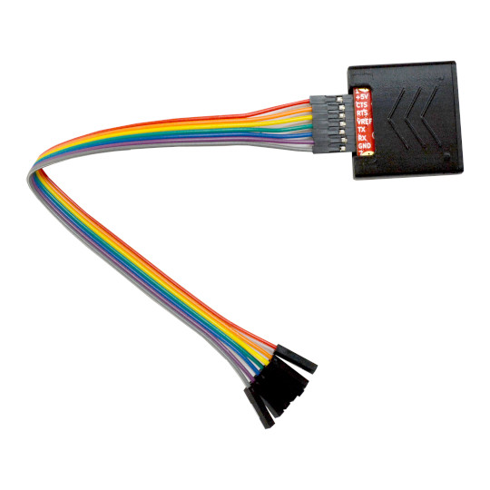

# USB-SERIAL-L
USB-SERIA-L is the ultimate Open Source Hardware USB to Serial converter with ful modem signals, supporting serial speeds from 100bps up to 3Mbps and with adjustable voltage levels from 0.65V up to 5V

https://www.olimex.com/Products/USB-Modules/USB-SERIAL-L/

## Licensee
* Hardware is released under CERN Open Hardware Licence Version 2 - Strongly Reciprocal
* Software is released under GPL V3 Licensee
* Documentation is released under CC BY-SA 4.0